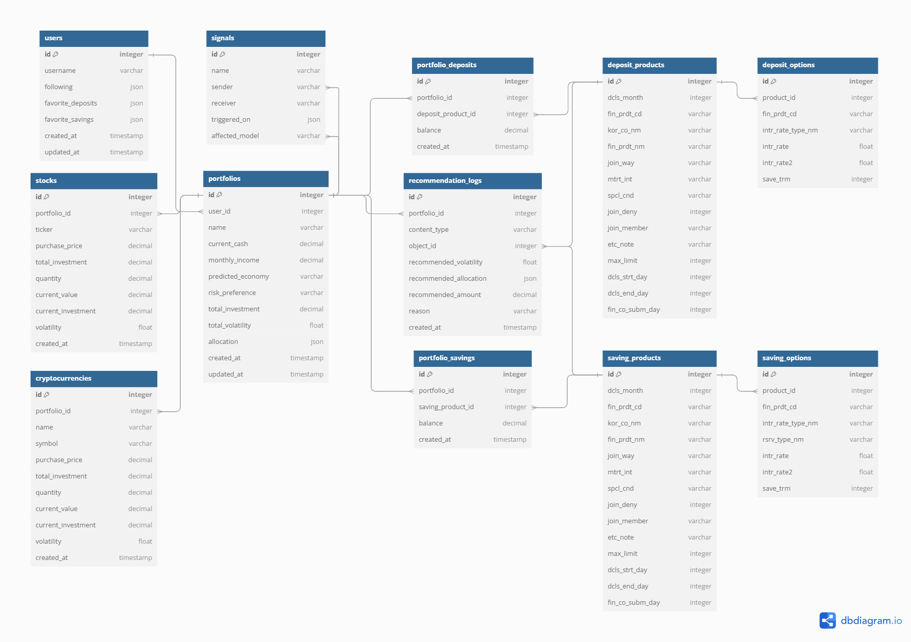

# 📚 금융 프로젝트 (WinneyMoney)

**WinneyMoney**는 **금융상품 추천 서비스**를 제공하는 웹 애플리케이션입니다. 이 프로젝트는 **Vue.js**와 **Django**를 기반으로 백엔드와 프론트엔드를 분리 개발하였으며, 사용자 경험을 극대화하기 위해 **카카오 지도 API**와 **금융상품통합비교공시 API**, **네이버 검색 API**, **한국수출입 은행 API**, **Finance Data Reader API**를 활용하였습니다. 사용자가 손쉽게 금융 상품을 비교하고 추천받을 수 있도록 설계되었습니다.

---

## 👥 팀원 소개 및 역할 분담

| 역할 | 이름 및 GitHub 링크 | 주요 담당 업무 |
|------|--------------------|----------------|
| 백엔드 및 프론트엔드 | [오승열](https://github.com/kwo9827) | 회원 커스터마이징, 예적금 금리 비교, 커뮤니티 게시판, 프로필 |
| 백엔드 및 프론트엔드 | [김승윤](https://github.com/purekim333) | 환율 계산기, 은행 검색, 금융상품 추천 알고리즘, 포트폴리오 |

---

## 📅 개발 일정

| 날짜       | 작업 내용                                   |
|------------|--------------------------------------------|
| 2024.11.18 | 프로젝트 계획 및 기획 회의                 |
| 2024.11.19 | 프로젝트 초기 세팅 (Django & Vue.js 환경 구축), 회원가입 및 로그인 기능 구현 |
| 2024.11.20 | 금융 상품 게시판 페이지 구현, 카카오 지도 API 연동 |
| 2024.11.21 | 금융상품 추천 알고리즘 설계               |
| 2024.11.22 | 환율 계산기 구현                          |
| 2024.11.24 | 백엔드 API 구현 및 테스트                 |
| 2024.11.25 | 코드 개선 및 프론트엔드 UI/UX 디자인 개선  |
| 2024.11.26 | 최종 점검 및 배포                         |
| 2024.11.27 | 최종 발표                                 |

---

## 📌 주요 기능


- 금융 상품 추천 알고리즘을 활용하여 맞춤형 금융 상품 추천
- 예금 및 적금 금리 비교 기능 제공
- 사용자 회원가입/로그인/로그아웃/회원탈퇴 기능
- 커뮤니티 게시판을 통한 사용자 간 정보 공유


- **Vue.js**와 **Django** 기반의 프론트엔드 및 백엔드 분리 구조
- **카카오 지도 API**를 활용한 은행 위치 정보 제공


- **한국수출입 은행 API**를 활용한 실시간 환율 계산기 제공


- **네이버 검색 API**를 활용한 최신 네이버 뉴스 제공


- **Chat GPT API**를 활용한 챗봇 기능 제공
- **Finance Data Reader API**를 활용하여 포트폴리오 자산 정보 업데이트 

---

## 🛠️ 기술 스택

- **Frontend:** Vue.js, JavaScript, Bootstrap
- **Backend:** Django, Django REST framework
- **Database:** SQLite (개발 단계)
- **API:** 카카오 지도 API, 금융상품통합비교공시 API, 한국수출입은행 API, 네이버 검색 API, Chat GPT API, Finance Data Reader API
- **Deployment:** 로컬 개발 환경 (향후 클라우드 서버 배포 예정)
- **Version Control:** Git, GitHub

---

## API 명세서

| **App**       | **Endpoint**                                     | **Method** | **Description**                                                     | **Authentication** |
|---------------|--------------------------------------------------|------------|---------------------------------------------------------------------|---------------------|
| **Accounts**  | `/accounts/auth/login/`                         | `POST`     | 사용자 로그인                                                       | ❌                  |
|               | `/accounts/auth/logout/`                        | `POST`     | 사용자 로그아웃                                                     | ✅                  |
|               | `/accounts/auth/password/change/`               | `POST`     | 비밀번호 변경                                                       | ✅                  |
|               | `/accounts/auth/password/reset/`                | `POST`     | 비밀번호 초기화 요청                                                | ❌                  |
|               | `/accounts/auth/password/reset/confirm/`        | `POST`     | 비밀번호 초기화 확인                                                | ❌                  |
|               | `/accounts/auth/user/`                          | `GET`      | 현재 로그인한 사용자 정보 조회                                      | ✅                  |
|               | `/accounts/change-password/`                    | `PUT`      | 비밀번호 변경                                                       | ✅                  |
|               | `/accounts/delete/`                             | `DELETE`   | 사용자 계정 삭제                                                    | ✅                  |
|               | `/accounts/detail/{username}/`                  | `GET`      | 특정 사용자의 상세 정보 조회                                        | ✅                  |
|               | `/accounts/edit/`                               | `PUT`      | 사용자 정보 수정                                                    | ✅                  |
|               | `/accounts/follow/{username}/`                  | `POST`     | 특정 사용자를 팔로우                                                | ✅                  |
|               | `/accounts/signup/`                             | `POST`     | 새로운 사용자 등록                                                  | ❌                  |
|               | `/accounts/signup/resend-email/`                | `POST`     | 인증 이메일 재발송                                                  | ❌                  |
|               | `/accounts/signup/verify-email/`                | `POST`     | 이메일 인증                                                         | ❌                  |
| **Articles**  | `/articles/`                                    | `GET`      | 게시글 목록 조회                                                    | ✅                  |
|               | `/articles/`                                    | `POST`     | 새 게시글 작성                                                      | ✅                  |
|               | `/articles/{article_pk}/`                       | `GET`      | 특정 게시글 조회                                                    | ✅                  |
|               | `/articles/{article_pk}/`                       | `PUT`      | 특정 게시글 수정                                                    | ✅                  |
|               | `/articles/{article_pk}/`                       | `DELETE`   | 특정 게시글 삭제                                                    | ✅                  |
|               | `/articles/{article_pk}/like/`                  | `POST`     | 특정 게시글 좋아요                                                  | ✅                  |
|               | `/articles/comment/{article_pk}/{parent_pk}/`   | `POST`     | 특정 게시글에 댓글 추가                                             | ✅                  |
|               | `/articles/comment/{comment_pk}/update/`        | `PUT`      | 특정 댓글 수정                                                      | ✅                  |
|               | `/articles/comment/{article_pk}/{comment_pk}/delete/` | `DELETE` | 특정 댓글 삭제                                                      | ✅                  |
| **Finlife**   | `/finlife/deposit-products/`                    | `GET`      | 예금 상품 목록 조회                                                 | ✅                  |
|               | `/finlife/deposit-products/`                    | `POST`     | 예금 상품 등록                                                      | ✅                  |
|               | `/finlife/deposit-products/detail/{product_id}/`| `GET`      | 특정 예금 상품 조회                                                 | ✅                  |
|               | `/finlife/favorites/`                           | `GET`      | 즐겨찾기한 금융 상품 목록 조회                                     | ✅                  |
|               | `/finlife/favorites/deposit/{fin_prdt_cd}/`     | `POST`     | 특정 예금 상품 즐겨찾기 추가                                        | ✅                  |
|               | `/finlife/favorites/saving/{fin_prdt_cd}/`      | `POST`     | 특정 적금 상품 즐겨찾기 추가                                        | ✅                  |
|               | `/finlife/saving-products/`                     | `GET`      | 적금 상품 목록 조회                                                 | ✅                  |
|               | `/finlife/saving-products/`                     | `POST`     | 적금 상품 등록                                                      | ✅                  |
|               | `/finlife/saving-products/detail/{product_id}/` | `GET`      | 특정 적금 상품 조회                                                 | ✅                  |
| **Portfolios**| `/portfolios/`                                  | `GET`      | 포트폴리오 목록 조회                                                | ✅                  |
|               | `/portfolios/`                                  | `POST`     | 새 포트폴리오 생성                                                  | ✅                  |
|               | `/portfolios/{portfolio_id}/`                   | `GET`      | 특정 포트폴리오 조회                                                | ✅                  |
|               | `/portfolios/{portfolio_id}/`                   | `PUT`      | 특정 포트폴리오 수정                                                | ✅                  |
|               | `/portfolios/{portfolio_id}/`                   | `DELETE`   | 특정 포트폴리오 삭제                                                | ✅                  |
|               | `/portfolios/{portfolio_id}/recommend/`         | `GET`      | 포트폴리오 기반 추천 데이터 반환                                    | ✅                  |
|               | `/portfolios/{portfolio_id}/stocks/`            | `POST`     | 포트폴리오에 주식 추가                                              | ✅                  |
|               | `/portfolios/{portfolio_id}/stocks/{stock_id}/` | `PUT`      | 특정 주식 수정                                                      | ✅                  |
|               | `/portfolios/{portfolio_id}/stocks/{stock_id}/delete/` | `DELETE` | 특정 주식 삭제                                                      | ✅                  |
|               | `/portfolios/{portfolio_id}/crypto/`            | `POST`     | 포트폴리오에 암호화폐 추가                                          | ✅                  |
|               | `/portfolios/{portfolio_id}/crypto/{crypto_id}/`| `PUT`      | 특정 암호화폐 수정                                                  | ✅                  |
|               | `/portfolios/{portfolio_id}/crypto/{crypto_id}/delete/` | `DELETE` | 특정 암호화폐 삭제                                                  | ✅                  |

--

## ERD



--

## 🚀 설치 및 실행 방법

### 1. 프로젝트 클론
```bash
git clone https://github.com/your-github-id/FINLIFE.git
```

### 2. 백엔드 설정
```bash
cd back_fin
python -m venv venv
source venv/bin/activate  # 윈도우: venv\Scripts\activate
pip install -r requirements.txt
python manage.py runserver
```

### 3. 프론트엔드 설정
```bash
cd vue-project
npm install
npm run dev
```

---

## 💡 기여 방법

1. 이 레포지토리를 포크하세요.
2. 새로운 브랜치를 생성하세요.
   ```bash
   git checkout -b feature/my-feature
   ```
3. 변경 사항을 커밋하세요.
   ```bash
   git commit -m "Add some feature"
   ```
4. 브랜치에 푸시하세요.
   ```bash
   git push origin feature/my-feature
   ```
5. Pull Request를 제출하세요.

---

## 🏆 프로젝트의 핵심 가치는 무엇인가요?

**WinneyMoney**는 복잡한 금융 상품 비교 및 선택 과정을 간소화하고, 사용자가 자신에게 적합한 금융 상품을 쉽고 빠르게 찾을 수 있도록 돕습니다. 직관적인 사용자 인터페이스와 정확한 추천 시스템을 통해 사용자 경험을 극대화하는 것을 목표로 합니다.
